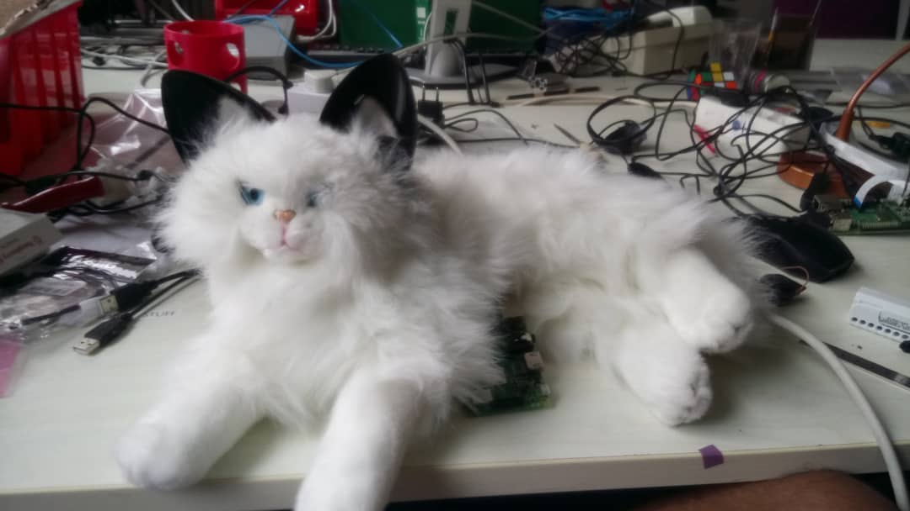

# FeRS (Feline Robot for Seeking attention)

Uses a state machine to control execution flow between states such as Awake, Annoyed, Calm, Sleep.

These 4 states are communicated with the human by using ear movement, tail movement and sounds.

Continious ROC for true and false positives of custom NN vs YOLOv3 vs MTCNN  by running evaluation from FDDB

